# chatbot-summary - ntq

<div style="display: flex;">
  <div style="flex: 1;">
    <a href="https://www.facebook.com/quang.nguyenthe.710">
      
    </a>
  </div>
  
  <div style="flex: 2;">
    <p>THIS IS AN APP FOR BRYCEN COMPANY DURING INTERNSHIP TO CHAT AND SUMMARY WITH AI ASSISTANTS by NTQ
</p>
  </div>
</div>

* Advanced AI-chatbot and summarize text / audio file
* My first projects -_-
* Chat with AI: Enjoy dynamic conversations with AI Chatbot, enable voice and message chat.
* Summarize: Extract key information from a .txt, .docx, or audio (.mp3, .wav, .mp4, .m4a) file, and ask anything about that. 

## USER INTERFACE

<!-- [](https://www.youtube.com/watch?v=R5Kr0DM3dJc) -->
https://github.com/22T1020362/Chatbot-Summary-ntq/assets/115056697/b001d515-10b4-49be-9e75-07a8eb91c316

## Screenshots

| Home                                 | Chat                                 | Summarize                                 |
|----------------------------------------------|----------------------------------------------|----------------------------------------------|
| 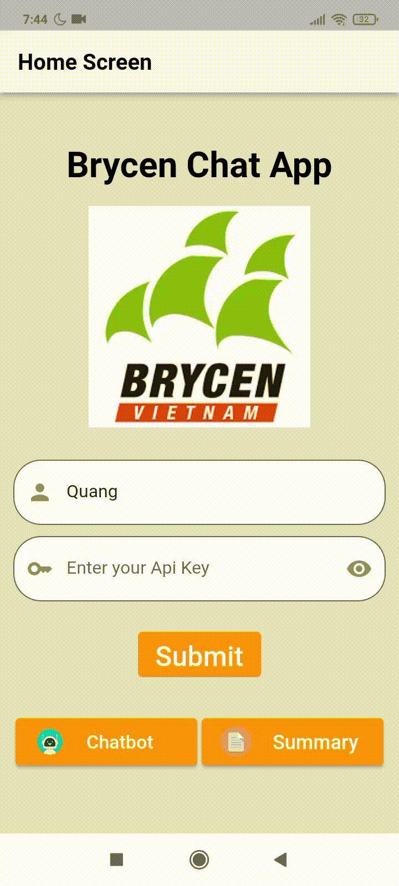 | 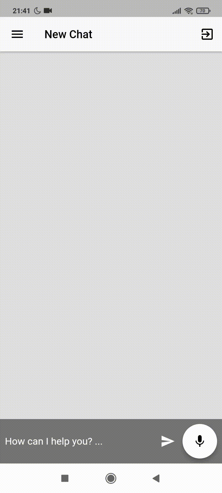 | 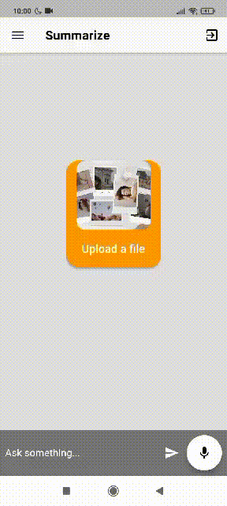 |


# HOW TO RUN THIS APP 

## I. Prerequisites

- **SYSTEM:** 4GB RAM, At Least 12GB of Free Space in C Drive, And 3.5GB of Free Space in your App Folder.
- **INSTALLED:** [npm](https://nodejs.org/en) (v18.17.0), [Flutter](https://docs.flutter.dev/get-started/install)(version in "pubspec.lock"), [Git](https://git-scm.com/downloads)(v2.41.0)
[VSCode](https://code.visualstudio.com/)(v1.81.1)

## II. Setup
### 1. Clone this github repository app

- Open a folder in your computer that you want to add this app.
- Open git (in step 2), then type:

```bash
git clone https://github.com/22T1020362/Chatbot-Summary-ntq
```
- Open your project terminal, then type:
```bash
flutter pub get
```
### 2. Setup flutterfire
- You can follow my **6 STEP** right below and also this link: 
```bash
https://firebase.google.com/docs/flutter/setup?hl=vi&platform=web
```
- **1, create your firebase project :**
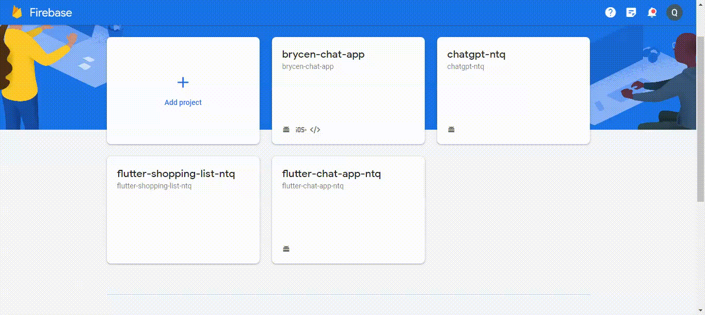

- **2, setup FlutterFire CLI:**


- **3, check if FlutterFire was installed:**
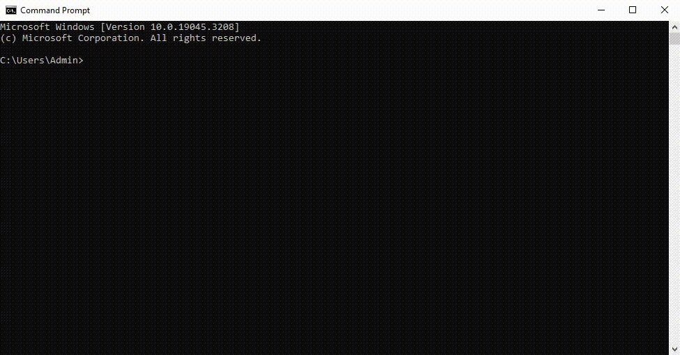

- **4, Activate flutterfire cli:**

- Remember if you meet an error like this:
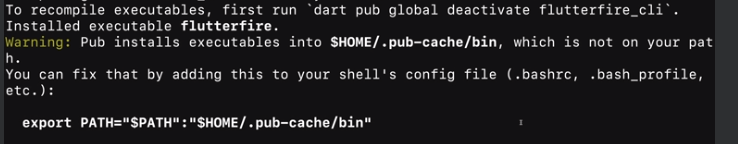
- You can follow this:
```bash
https://itslinuxfoss.com/export-path-something-path-mean-linux/#:~:text=The%20%E2%80%9Cexport%20PATH%3Dsomething%3A%24PATH%E2%80%9D%20command%20changes%20the,add%20multiple%20directories%20to%20PATH.
```
- or:
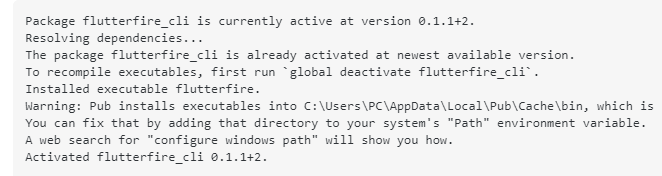
- You can follow this link to fix:
```bash
https://stackoverflow.com/questions/70320263/error-the-term-flutterfire-is-not-recognized-as-the-name-of-a-cmdlet-functio
```

- After this a file call ```firebase_option.dart``` will be create in your folder. If not, you should repeat this step 4 again.

- **5, Create Realtime Database and Firestore Database**

- **6, Configure your flutterfire.**

- You can follow this video:

 

- Or you can read this:
    + Type this:
    ```
    flutterfire configure 
    ```
    + (CHOOSE THE FIREBASE PROJECT YOU JUST CREATE ABOVE TO LINK TO THIS APP)
    + (CHOOSE YES TO ALL TO REPLACE MY FIREBASE_OPTIONS.DART FILE WITH YOURS)


### 3. Follow these steps: 
- Follow this video:
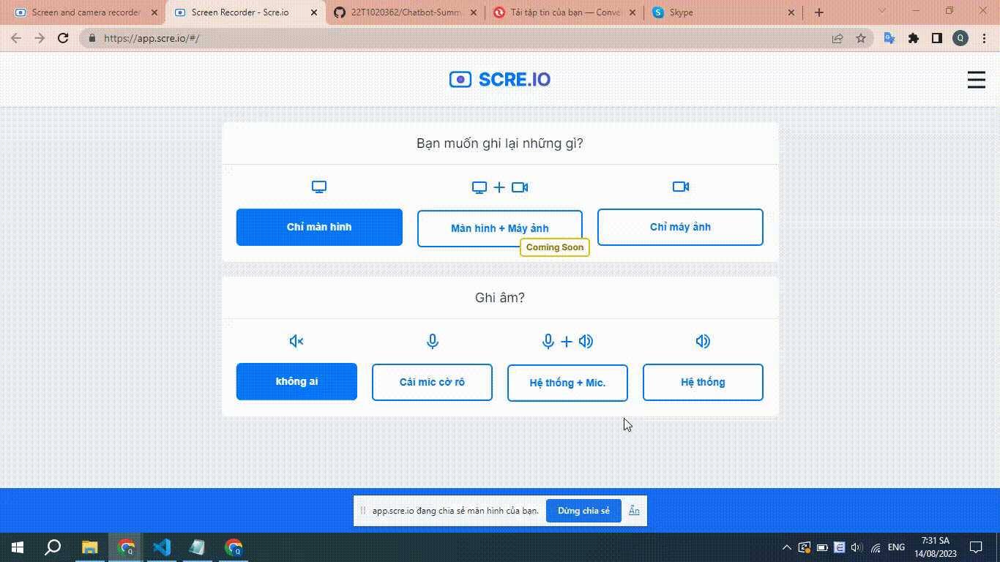

- Or read this:
    + Get a ChatGPT API-KEY . You can log in to 'https://platform.openai.com/account/api-keys' to get one or simply just borrow ones.
    + Use that key to log into 'http://api.openai.com/v1/models' with username blanks (not insert anything) and password is your API-KEY.

### 4. Fill in the code
- In the lib folder contains the code of this app, you must update (change) my comments, for example: 
```bash
'--YOUR HTTPS LINK TO THE REALTIME DATABASE--'
```
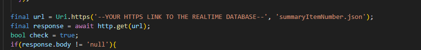
- (and more places that the same with this image)

- with your https link:
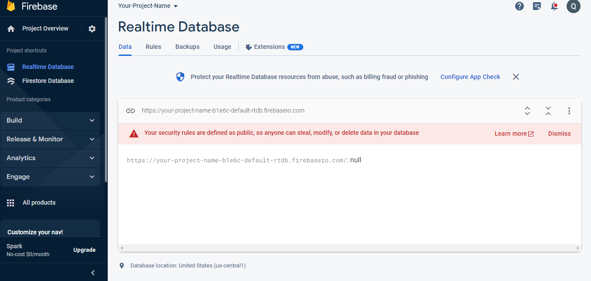

## III. Run App

- This app can run on Web(recommended Chrome latest version) and Android( with version 12 or later).
- **To run this app on Web, just open your project terminal in your code editor (mine is VS Code) and type:**
```bash
flutter run lib/main.dart
```
- **To run this app on Android, you must have an .apk file of this app. To have that, follow this video:**

- After that, locale the 'app-release.apk' file in the video (or you can see in the image below):
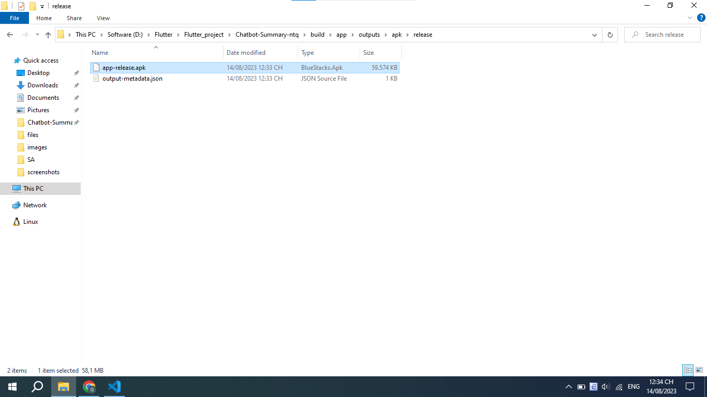
- You can download that to your mobile phone (android) or run on an android emulator (like android studio, or online web:
https://appetize.io )

## Time Tracking

| Date         | Task                | Notes                                               |
|--------------|---------------------|-----------------------------------------------------|
| 20/07/2023     | Project setup       |                                                     |
| 21/07/2023 | First Setup     | First upload about the app. |
| 22-23/07/2023 | Create Chat Screen  | Create the Chat Screen, add ChatBot     |
| 24/07/2023     | Update Home Screen and Chat Screen        | Fixed check condition for api_key at the Home Screen. Update Chat Screen and Save Api Key when Submit at Home Screen : Human chat at Left, AI chat at Right.   |
| 25/07/2023 | Firebase Connection And Update App | Set up Firebase_CIL and implemented file upload to Firebase. Chat Screen: use LangChain, not have memory yet. Fixed API Key submit  |
| 26-27/07/2023     | Update Chat Screen       |   Complete add memory for chatbot. Change Android SDK minVersion, fixed the UI for micro in chat app. Complete fixed microphone. Add pick file and summarize text for summarize screen      |
| 28/07/2023     | Update UI for all / Chat Screen and Summarize Screen       |  Completed fixed the UI for all. Fixed language recognition for ChatBot response(response same language for what user ask)  |
| 29/07/2023     | Update Summarize Screen       | Upload pick .txt and .pdf files. Need to find a way to upload audio file? And ask logic?    |
| 31/07/2023     | Fix BackEnd Firebase       | Fixed Firebase BackEnd for Chat App and complete chat screen. Fixed UI for summarize screen  |
| 01-03/08/2023     | Fixed UI for Summarize Screen, Firebase       |     |
| 04/08/2023     | Fixed Summarize  |   Fix QA & summarize  |
| 05-06/08/2023     | Menu Bar      |   Fixing...  |
| 07-09/08/2023     | UI     |  Save apiKey and username when start home screen, add expanded to text   |   
| 10/08/2023     | MenuBar     |  Add Delete Button to Menu   | 
| 11/08/2023     | Firebase     |  Fixed firebase   |
| 12-14/08/2023     | Write readme file     |  |
| 15-16/08/2023     | Add comment     |  |