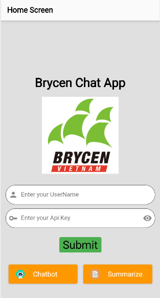
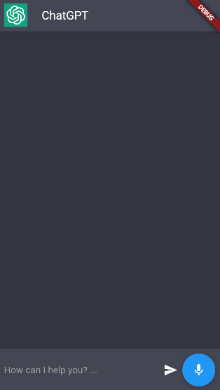

# chatbot-summary - ntq

<div style="display: flex;">
  <div style="flex: 1;">
    <a href="https://www.facebook.com/quang.nguyenthe.710">
      
    </a>
  </div>
  
  <div style="flex: 2;">
    <p>THIS IS AN APP FOR BRYCEN COMPANY DURING INTERNSHIP TO CHAT AND SUMMARY WITH AI ASSISTANTS by NTQ
</p>
  </div>
</div>

## Features

* Advanced AI-chatbot and summarize text / audio file
* My first projects -_-
* Chat with AI: Enjoy dynamic conversations with AI Chatbot, enable voice and message chat.
* Summarize: Extract key information from a text (.txt) file, and ask anything about that. 

## Screenshots

| Screenshot 1                                 | Screenshot 2                                 | Screenshot 3                                 |
|----------------------------------------------|----------------------------------------------|----------------------------------------------|
|  |  |  |


# HOW TO USE 

1. Install NODEJS

- First, you need to download 'NODEJS' follow this link: 
```bash
https://nodejs.org/en/download

```
 (follow your operating system). 
- After that, open setup file and install it. Just wait until the NODEJS terminal open and then close it.
- Open terminal, check NODEJS version type: node -v . It should show a version, if not you should install it again.

2. Install git
- First, you need to download 'GIT' follow this link:
```bash
 https://git-scm.com/downloads

```
(follow your operating system).

- After that, open setup file and install it.

3. Install VS CODE
- Follow the video in this link:
```bash
 https://code.visualstudio.com/learn/get-started/basics

```


4. Clone this github repository app
- Open a folder in your computer you want to add this app.
- Open git (in step 2), then type:

```bash
git clone https://github.com/22T1020362/Chatbot-Summary-ntq

```

- After that, the app's file and folder for this app will show in that folder.

5. Setup flutterfire

- Follow this link: https://firebase.google.com/docs/flutter/setup?platform=ios
- Open your terminal (cmd) and type this :
```
npm i -g firebase-tools
```
```
firebase login 
```
```
dart pub global activate flutterfire_cli
```
You might encounter the error ```command not found: flutterfire``` . In this case, you need to add the path that has been indicated when running the ```flutterfire_cli``` mismatch activation to your computer's environment. (link: https://learn.microsoft.com/en-us/previous-versions/office/developer/sharepoint-2010/ee537574(v=office.14) )

After this command a file call ```firebase_option.dart``` will be create in your folder. If not, you should repeat this step 4 again.

- Close terminal, open terminal in VS CODE in your project app (step 3). Type this:
```
flutterfire configure
```
```
flutter pub add firebase_core
```
Run this again to make sure everything installed in your computer 
```
flutterfire configure
```

6. Install dependencies
- Type this in the terminal in your app on VS CODE:

```bash
flutter pub get

```

7. Follow these steps: 

- Get a ChatGPT API-KEY . You can log in to 'https://platform.openai.com/account/api-keys' to get one or simply just borrow ones.
- Use that key to log into 'http://api.openai.com/v1/models' with username blanks (not insert anything) and password is your API-KEY.

8.Fill in the code
- In the lib folder contains the code of this app, must update (change) my comment, for example: 
```bash
(--YOUR API KEY--)

```
or 
```bash
(--YOUR HTTPS LINK TO THE REALTIME DATABASE--)

```
etc,... with your Api Key or https link.

## Usage
To use this app, you must enter a GPT Api-key created before or borrowed, submit it by button 'submit' for first time. After that, you can press the key button on the begin of textfield to take that key again. After submit, press 'Chat' to have chat with ChatBot, or press 'Summarize' to summary a text or audio file, and ask question about it.


## Acknowledgements

This app was built using the following open-source libraries and tools:

* [Flutter](https://flutter.dev/)
* [Dart](https://dart.dev/)
* [OpenAI GPT](https://beta.openai.com/)
* [Firebase](https://firebase.google.com/docs/flutter/setup)


## Time Tracking

| Date         | Task                | Notes                                               |
|--------------|---------------------|-----------------------------------------------------|
| 20/07/2023     | Project setup       |                                                     |
| 21/07/2023 | First Setup     | First upload about the app. First code is about the UI of Home-Screen of the app, which have a submit API Key TextField, an Chat Button to switch to Chat-Screen (Chat with AI) and Summary Button to switch to Summary-Screen           |
| 22/07/2023 | Create Chat Screen  | Create the Chat Screen and add code to the Summarize Screen             |
| 23/07/2023 | Update Chat Screen       | Fixed Chat Screen and add the first AI chatbot to chat with human in that Chat Screen. This chatbot not have memory yet.      |
| 24/07/2023     | Update Home Screen and Chat Screen        | Fixed check condition for api_key at the Home Screen. Fixed Chat Screen and Save Api Key when Submit at Home Screen : Human chat at Left, AI chat at Right.   |
| 25/07/2023 | Firebase Connection And Update App | Set up Firebase_CIL and implemented file upload to Firebase. Chat Screen: use LangChain, not have memory yet. Fixed API Key submit  |
| 26/07/2023     | Update Chat Screen       |   Complete add memory for chatbot while chat with human in chat screen, using FirebaseFirestore. Change Android SDK minVersion, fixed the UI for micro in chat app.      |
| 27/07/2023     | Update Chat Screen and Summarize Screen      |   Completed fixed the microphone in Chat Screen. Added the pick file and summarize text for summarize screen, but has error with send ask message.        |
| 28/07/2023     | Update UI for all / Chat Screen and Summarize Screen       |  Completed fixed the UI for all. Fixed language recognition for ChatBot response(response same language for what user ask)  |
| 29/07/2023     | Update Summarize Screen       | Upload pick .txt and .pdf files. Need to find a way to upload audio file? And ask logic?    |
| 31/07/2023     | Fix BackEnd Firebase       | Fixed Firebase BackEnd for Chat App and complete chat screen. Fixed UI for summarize screen  |
| 01/08/2023     | Fixed UI for Summarize Screen       |     Fixed      |
| 02/08/2023     | Fixed Firebase and Summarize Screen      |     Fixed      |
| 03/08/2023     | Fixed UI of Summarize Screen      |     Continue fixed display of suggest question      |
| 04/08/2023     | Fixed Summarize...      |   Fix QA & summarize  |
| 05/08/2023     | Menu Bar      |   Fixing...  |
| 06/08/2023     | Menu Bar      |   Fixing...  |
| 07/08/2023     | UI     |  Save apiKey and username when start home screen   |   
| 08/08/2023     | UI     |  Fixing   |
| 09/08/2023     | UI     |  Add Expanded to Text   |  
| 10/08/2023     | MenuBar     |  Add Delete Button to Menu   | 